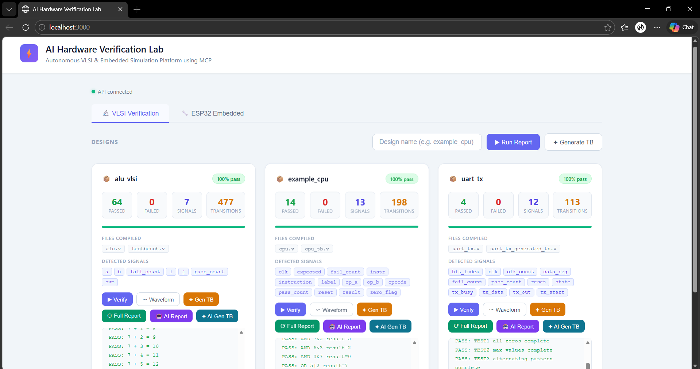
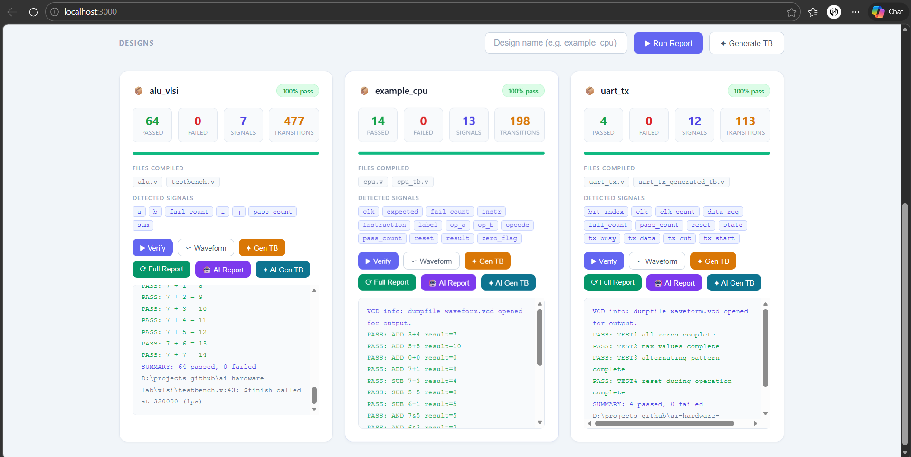
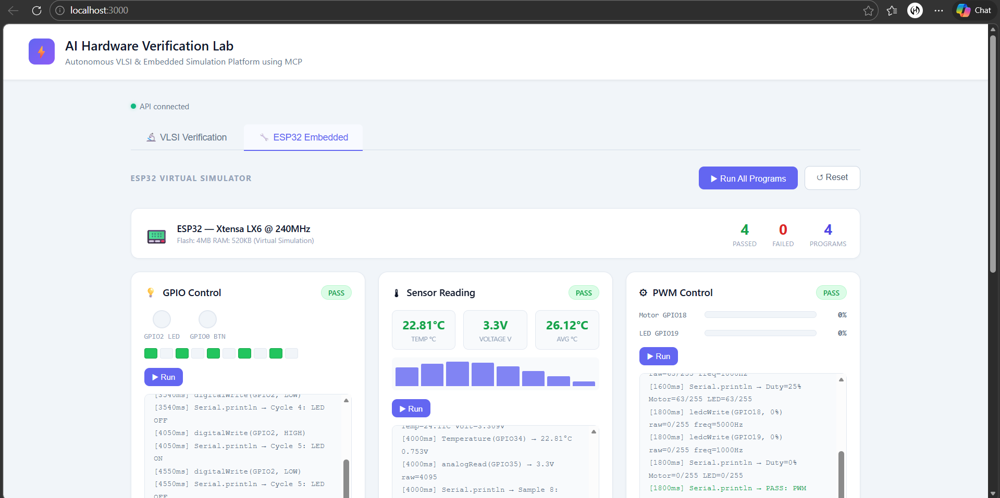
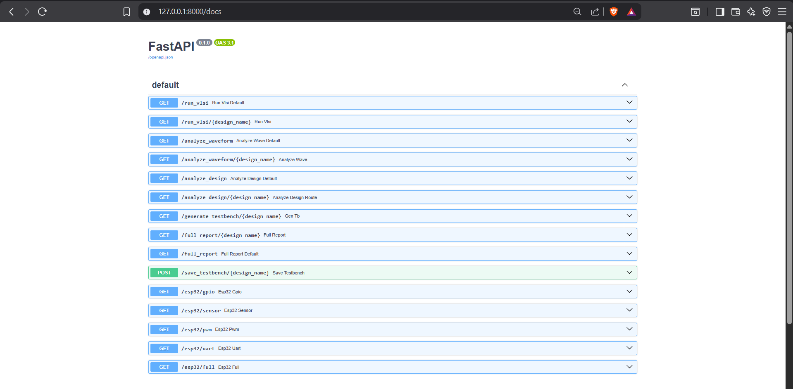

# AI-Driven Autonomous Hardware Verification and Embedded Simulation Platform using MCP

> Automated VLSI verification and ESP32 embedded simulation platform powered by AI and Model Context Protocol architecture.


---

## What This Project Does

Traditional hardware verification requires engineers to manually write test cases, run simulations, inspect waveforms, and generate reports — all using separate tools. This platform automates the entire workflow.

Drop any Verilog design file into the system. The platform automatically:
- Generates a testbench using AI
- Compiles and runs simulation using Icarus Verilog
- Analyzes the output waveform
- Detects potential design issues
- Returns a structured verification report via REST API
- Uses Claude AI to explain results in plain English

The same platform also runs a virtual ESP32 simulator for embedded system verification — supporting GPIO, sensors, PWM, and UART.

---

## Live Demo
```bash
# Start everything with one command
start.bat
```

Open `http://localhost:3000` to see the dashboard.

---

## Screenshots

### VLSI Verification Dashboard


### Simulation Output with AI Analysis


### ESP32 Embedded Simulation


### REST API Endpoints


---

## Project Architecture
```
User / Web Dashboard (localhost:3000)
              │
              ▼
    FastAPI MCP Server (:8000)
              │
    ┌─────────┴──────────────┐
    │                        │
    ▼                        ▼
VLSI Engine             ESP32 Simulator
    │                        │
    ├── Simulation Engine     ├── GPIO Controller
    ├── AI Testbench Gen      ├── Sensor Simulator
    ├── Waveform Analyzer     ├── PWM Controller
    └── Design Analyzer       └── UART Engine
              │
              ▼
    Claude AI via Puter.js
    (no API key required)
```

---

## Features

### VLSI Verification
- Drag and drop any `.v` file — folder created automatically
- Automatic testbench generation from any Verilog module
- AI-powered testbench generation using Claude (writes real test cases)
- Simulation using Icarus Verilog (industry standard)
- Waveform signal analysis from VCD files
- Static design analysis — detects overflow risks, missing resets, undriven signals
- Claude AI explains verification results in plain English

### ESP32 Embedded Simulation
- Drag and drop any `.py` project file — runs automatically
- Virtual ESP32 hardware simulation (no physical hardware needed)
- Generic project runner — any program with `run(esp)` function works
- GPIO control with LED blink cycles
- Temperature and voltage sensor simulation
- PWM motor and LED control
- UART serial communication with loopback testing
- 4 built-in example programs + 4 generic projects included

### Web Dashboard
- Two-tab interface — VLSI Verification and ESP32 Embedded
- File upload with drag and drop for both `.v` and `.py` files
- Live pass/fail results with progress bars
- Signal tag display from waveform analysis
- Design warning alerts
- AI Report button — Claude analyzes your design
- AI Gen TB button — Claude writes a smart testbench
- One-click startup with `start.bat`

---

## Tech Stack

| Layer | Technology |
|---|---|
| Simulation | Icarus Verilog, VVP |
| Backend | Python, FastAPI |
| File Upload | python-multipart |
| AI Integration | Claude via Puter.js (no API key needed) |
| Protocol | MCP — Model Context Protocol |
| Frontend | HTML, CSS, JavaScript |
| Embedded Engine | Python virtual ESP32 simulator |
| Frontend Server | Flask |

---

## Project Structure
```
ai-hardware-lab/
│
├── mcp_server/
│   ├── server.py               # FastAPI server — 20+ endpoints
│   └── tools.py                # MCP tool functions
│
├── vlsi/
│   ├── alu.v                   # ALU design
│   ├── testbench.v             # ALU testbench — 64 test cases
│   ├── test_generator.py       # Generic simulation engine
│   ├── waveform_analyzer.py    # VCD signal analysis
│   └── design_analyzer.py      # Static code analysis
│
├── designs/
│   ├── example_cpu/            # CPU design — 14 test cases
│   └── uart_tx/                # UART transmitter
│
├── embedded/
│   ├── esp32_simulator.py      # Virtual ESP32 hardware model
│   ├── esp32_programs.py       # Built-in GPIO/sensor/PWM/UART programs
│   ├── project_runner.py       # Generic project runner
│   └── projects/               # Drop any .py project here
│       ├── blink_led.py
│       ├── temperature_monitor.py
│       ├── motor_control.py
│       └── smart_sensor.py
│
├── ai_agent/
│   ├── agent.py                # Verification report agent
│   └── tb_generator.py         # AI testbench generator
│
├── frontend/
│   ├── index.html              # Dashboard — two tabs
│   ├── css/style.css           # Light theme
│   ├── js/app.js               # VLSI tab logic + file upload
│   ├── js/esp32.js             # ESP32 tab — dynamic project cards
│   └── serve.py                # Flask frontend server
│
├── requirements.txt
├── start.bat                   # One-click startup
└── README.md
```

---

## How to Run

### Requirements
- Python 3.10+
- Icarus Verilog — https://bleyer.org/icarus/
- Git

### Setup
```bash
# Clone the repo
git clone https://github.com/Hetvirani/ai-hardware-lab.git
cd ai-hardware-lab

# Create virtual environment
python -m venv venv
venv\Scripts\activate        # Windows
source venv/bin/activate     # Mac/Linux

# Install dependencies
pip install fastapi uvicorn pydantic flask python-multipart

# Start everything
start.bat                    # Windows
```

### Manual start (two terminals)

**Terminal 1 — API Server**
```bash
cd mcp_server
uvicorn server:app --reload
```

**Terminal 2 — Dashboard**
```bash
cd frontend
python serve.py
```

Open `http://localhost:3000`

---

## How to Verify Any Verilog Design

1. Open dashboard → VLSI tab
2. Type a design name in the upload field
3. Drag and drop your `.v` file into the upload zone
4. Platform auto-creates the folder, runs simulation, shows results
5. Click **AI Report** for Claude's analysis

---

## How to Add Any Embedded Project

1. Open dashboard → ESP32 tab
2. Drag and drop your `.py` project file into the upload zone
3. Project appears automatically and runs immediately

Your project file must have a `run(esp)` function:
```python
"""
Project: My Project
Platform: ESP32
Description: What this does
"""

def run(esp):
    esp.uart_begin(115200)
    esp.uart_print("Hello ESP32")
    esp.tick(100)
    return {"project": "My Project", "status": "PASS"}
```

---

## API Endpoints

| Endpoint | Description |
|---|---|
| `GET /full_report/{design}` | Complete verification report |
| `GET /run_vlsi/{design}` | Run simulation only |
| `GET /analyze_waveform/{design}` | Waveform signal analysis |
| `GET /analyze_design/{design}` | Static code analysis |
| `GET /generate_testbench/{design}` | Auto-generate testbench |
| `POST /upload/vlsi` | Upload .v file and create design |
| `POST /upload/embedded` | Upload .py project file |
| `POST /save_testbench/{design}` | Save AI-generated testbench |
| `GET /esp32/full` | Run all built-in ESP32 programs |
| `GET /embedded/projects` | List all generic projects |
| `GET /embedded/run/{project}` | Run a specific project |
| `GET /embedded/run_all` | Run all generic projects |

---

## Verified Designs

| Design | Tests | Result |
|---|---|---|
| ALU (4-bit adder) | 64 | ✅ All pass |
| CPU (single-cycle) | 14 | ✅ All pass |
| UART Transmitter | 4 | ✅ All pass |
| ESP32 GPIO | 5 cycles | ✅ Pass |
| ESP32 Sensors | 8 samples | ✅ Pass |
| ESP32 PWM | 9 steps | ✅ Pass |
| ESP32 UART | 8 messages | ✅ Pass |
| LED Blink | 6 cycles | ✅ Pass |
| Temperature Monitor | 10 samples | ✅ Pass |
| Motor Control | 10 steps | ✅ Pass |
| Smart Sensor Node | 8 packets | ✅ Pass |

---

## Why This Project

This platform was built to demonstrate how AI can automate the hardware verification workflow — a critical and time-consuming process in chip design. Companies like NVIDIA, Intel, and Synopsys invest heavily in verification automation. This project implements a simplified but functional version of that pipeline.

The project combines five areas rarely seen together in student work:
- AI agents and LLM integration
- VLSI digital circuit verification
- Embedded systems simulation
- Modern API architecture (MCP)
- Automated software engineering

---

## Author

Het Virani — [GitHub](https://github.com/Hetvirani)

---